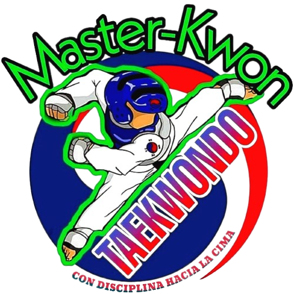

# Master-Kwon 🥋
Creation of a web application for the control of athletes and coaches of the Master Kwon Desamparados Taekwondo Academy



## Table of content 

- [Tech Stack](#tech-stack-🛠)
- [Development Setup](#development-setup-📎)
- [Local Setup](#local-setup-📃)
- [Production Setup](#production-setup-📦)
- [Author](#author-🖋)

## Tech Stack 🛠

**Server:** NodeJs - Express \
**Client:** Handlebars - Bootstrap 4 - CSS3

## Development Setup 📎

Clone the repository 

```bash 
git clone https://github.com/ErickSolisR16/Master-Kwon.git
```

Go to the project directory

```bash 
cd Master-kwon
```

### Local Setup 📃

Install dependencies

```bash
npm install
```

Development environment, to build the application we use the following:

```bash
npm run dev
```
We open the address in our browser localhost:8000 (predefined address) 

### Production Setup 📦

Production environment, for the application:

```bash
npm start
```

## Author 🖋

* **[Erick Solis](https://github.com/ErickSolisR16)** *Developer*
